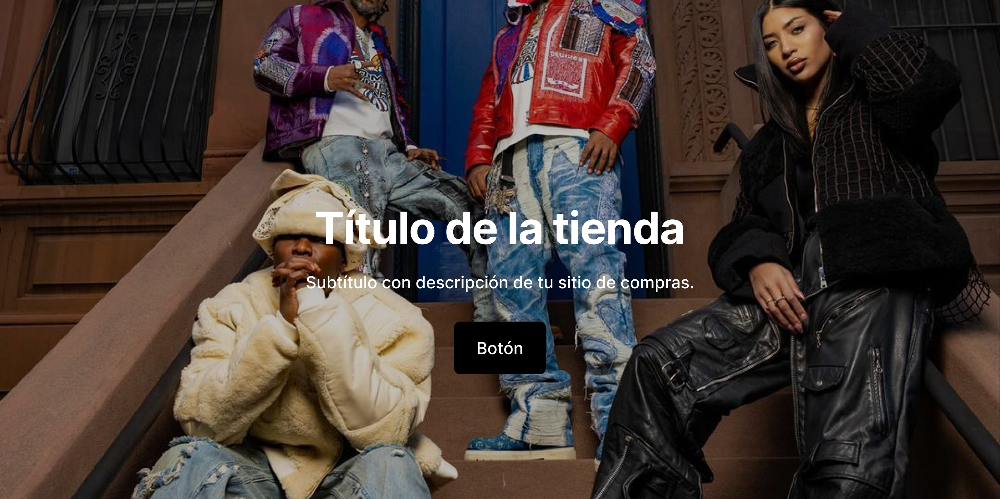
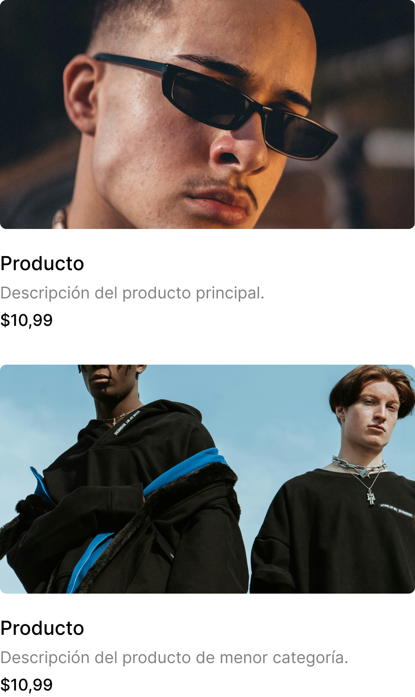
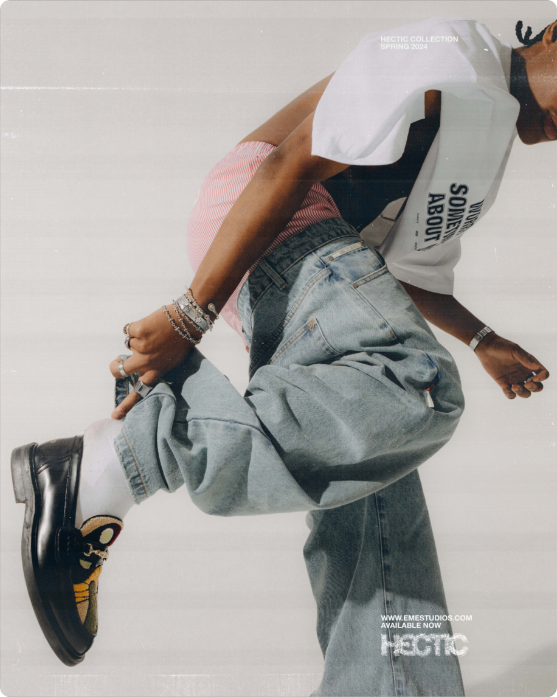
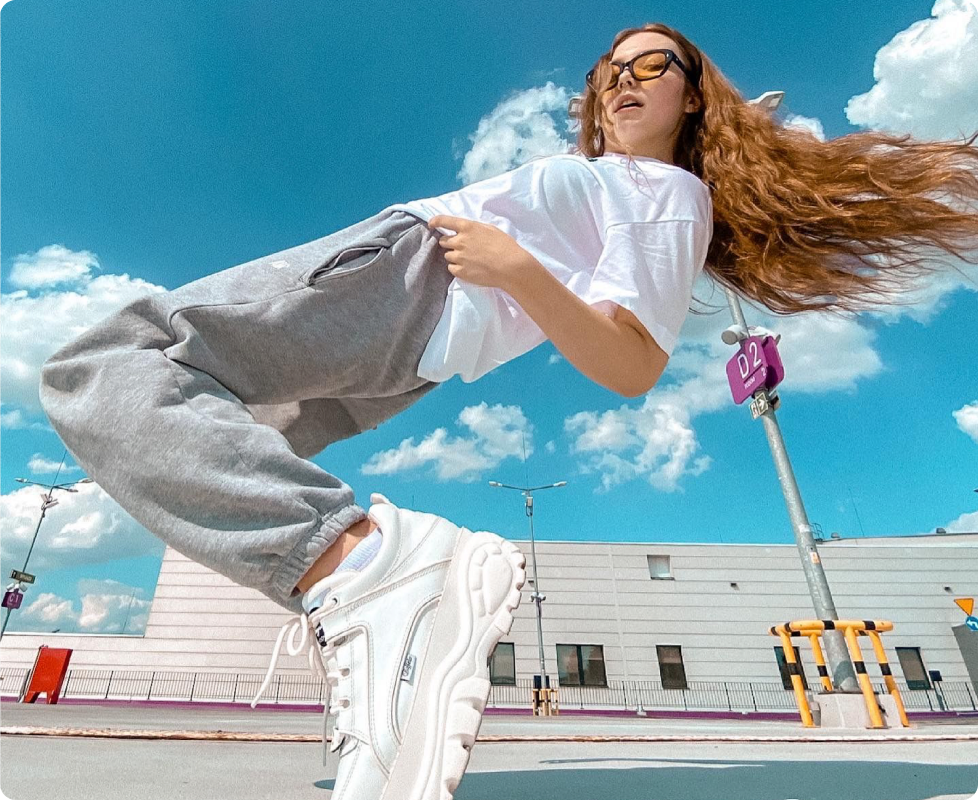
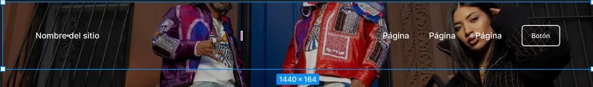
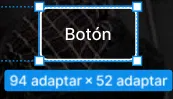

# Actividad 2: Ingeniería inversa de un mockup

## Contexto

Frame analizado: **Shop** (template de tienda en línea streetwear — Figma)
Ancho de referencia del frame: **1442 px**
Ancho de contenedor de contenido (descontando márgenes laterales de 80 px cada lado): **1282 px**

Se aplica la fórmula de la sección 7.4 del material de estudio:

```
c = 12 × (w / W)
```

donde `w` es el ancho del elemento y `W` el ancho del contenedor de referencia.

---

## Elemento 1: Header con imagen (Hero)



| Propiedad | Valor |
|---|---|
| Ancho elemento | 1442 px |
| Ancho contenedor | 1442 px (full-bleed, sin márgenes) |
| Proporción | 100 % |
| Columnas (grilla de 12) | 12/12 |

**Comportamiento por breakpoint**

| Rango | Clase Bootstrap 3 | Comportamiento |
|---|---|---|
| Escritorio (`col-lg-*`) | `col-lg-12` | Ocupa todo el ancho del viewport |
| Tablet (`col-sm-*`) | `col-sm-12` | Ocupa todo el ancho del viewport |
| Móvil (`col-xs-*`) | `col-xs-12` | Ocupa todo el ancho del viewport; altura se reduce proporcionalmente |

**Escala / refluye / transforma:** **Escala.** La imagen mantiene proporción (`background-size: cover` o `object-fit: cover`) y se recorta de forma controlada en anchos menores; no cambia de posición ni de fila.

---

## Elemento 2: Card grande — producto destacado


| Propiedad | Valor |
|---|---|
| Ancho elemento | 735 px |
| Ancho contenedor | 1282 px |
| Proporción | 735 / 1282 = 0,5734 → **57,3 %** |
| Columnas (grilla de 12) | 12 × 0,5734 = 6,88 ≈ **7/12** |

**Comportamiento por breakpoint**

| Rango | Clase Bootstrap 3 | Comportamiento |
|---|---|---|
| Escritorio (`col-lg-*`) | `col-lg-7` | Se ubica junto a la card list (7/12 + 5/12) |
| Tablet (`col-sm-*`) | `col-sm-12` | Pasa a ancho completo, se apila sobre la card list |
| Móvil (`col-xs-*`) | `col-xs-12` | Ancho completo, imagen reduce su altura |

**Escala / refluye / transforma:** **Refluye.** En escritorio comparte fila con la card list (relación 7/5); desde tablet hacia abajo cambia de fila y pasa a ocupar el 100 % del ancho, apilándose verticalmente.

---

## Elemento 3: Card list (dos productos apilados)



| Propiedad | Valor |
|---|---|
| Ancho elemento | 515 px |
| Ancho contenedor | 1282 px |
| Proporción | 515 / 1282 = 0,4017 → **40,2 %** |
| Columnas (grilla de 12) | 12 × 0,4017 = 4,82 ≈ **5/12** |

**Comportamiento por breakpoint**

| Rango | Clase Bootstrap 3 | Comportamiento |
|---|---|---|
| Escritorio (`col-lg-*`) | `col-lg-5` | Junto a la card grande (7/5) |
| Tablet (`col-sm-*`) | `col-sm-12` | Ancho completo, debajo de la card grande |
| Móvil (`col-xs-*`) | `col-xs-12` | Ancho completo; las dos cards internas se apilan una sobre otra |

**Escala / refluye / transforma:** **Refluye.** Mismo caso que el elemento 2: relación proporcional en escritorio, apilamiento completo desde tablet. Internamente, las dos cards que contiene también refluyen de "una al lado de la otra" a "una debajo de la otra" en móvil si el ancho de cada una es insuficiente.

---

## Elemento 4: Imagen de la sección "Copy" (foto de producto)



> Nota: tras revisar el archivo, se ajustó este elemento para medir la **imagen** de la sección (no el bloque de texto), ya que su ancho fue modificado manualmente en Figma durante el proceso de reemplazo de placeholders por fotos reales — es un buen ejemplo de cómo una decisión de diseño (dar más o menos espacio a la imagen vs. el texto) cambia directamente el cálculo de columnas.

| Propiedad | Valor |
|---|---|
| Ancho elemento | 458 px |
| Ancho contenedor | 1280 px |
| Proporción | 458 / 1280 = 0,3578 → **35,8 %** |
| Columnas (grilla de 12) | 12 × 0,3578 = 4,29 ≈ **4/12** |

**Comportamiento por breakpoint**

| Rango | Clase Bootstrap 3 | Comportamiento |
|---|---|---|
| Escritorio (`col-lg-*`) | `col-lg-4` | Al costado del bloque de texto (4/12 + 8/12 aprox.) |
| Tablet (`col-sm-*`) | `col-sm-12` | Ancho completo, debajo o encima del texto |
| Móvil (`col-xs-*`) | `col-xs-12` | Ancho completo; la imagen reduce su altura manteniendo proporción |

**Escala / refluye / transforma:** **Refluye.** En escritorio comparte fila con el bloque de texto; desde tablet hacia abajo pasa a ocupar el 100% del ancho y cambia de fila (se apila).

---

## Elemento 4b: Segunda imagen de producto (fila inferior, sección Copy)



| Propiedad | Valor |
|---|---|
| Ancho elemento | 489 px |
| Ancho contenedor | 1280 px |
| Proporción | 489 / 1280 = 0,3820 → **38,2 %** |
| Columnas (grilla de 12) | 12 × 0,3820 = 4,58 ≈ **5/12** |

**Comportamiento por breakpoint**

| Rango | Clase Bootstrap 3 | Comportamiento |
|---|---|---|
| Escritorio (`col-lg-*`) | `col-lg-5` | Al costado de su bloque de texto correspondiente |
| Tablet (`col-sm-*`) | `col-sm-12` | Ancho completo |
| Móvil (`col-xs-*`) | `col-xs-12` | Ancho completo, altura reducida proporcionalmente |

**Escala / refluye / transforma:** **Refluye.** Mismo patrón que el elemento 4: relación proporcional con su texto en escritorio, apilamiento completo desde tablet.

**Observación de diseño:** estas dos imágenes (458 px y 489 px) forman parte de la misma sección repetida dos veces en el frame (imagen + texto, alternando lados). Antes del reemplazo de fotos ambas medían un ancho distinto entre sí (625 px y 624 px); al insertar las fotografías reales se ajustaron a 458 px y 489 px respectivamente, lo que demuestra que la elección de una imagen real (su encuadre, sujeto y orientación) puede motivar cambios legítimos en la proporción del layout — no todo tiene que calzar en el redondeo original del mockup.

---

## Elemento 5: Botón de la barra de navegación





> Ambas capturas se tomaron directamente desde Figma (no mediante exportación aislada del elemento). La primera muestra el contexto completo de la barra de navegación (1440 × 164 px) — "Nombre del sitio", los tres links "Página" y el botón — todo visible en blanco sobre la foto de fondo del hero. La segunda hace zoom al botón específico que se está midiendo (94 × 52 px), con el panel de medidas de Figma visible.
>
> Se optó por este formato en vez de una exportación normal (`download_assets`) porque el texto y el botón de esta sección están diseñados en color blanco para contrastar con la imagen oscura de fondo del hero. Al exportar el elemento de forma aislada (sin su fondo), tanto la barra completa como el botón se veían completamente en blanco — invisibles, por ser blanco sobre blanco. Las capturas directas desde el lienzo de Figma resuelven este problema porque conservan el fondo real.

| Propiedad | Valor |
|---|---|
| Ancho elemento | 94 px |
| Ancho contenedor | 1280 px |
| Proporción | 94 / 1280 = 0,0734 → **7,3 %** |
| Columnas (grilla de 12) | 12 × 0,0734 = 0,88 ≈ **1/12** |

**Comportamiento por breakpoint**

| Rango | Clase Bootstrap 3 | Comportamiento |
|---|---|---|
| Escritorio (`col-lg-*`) | `col-lg-1` (dentro de la barra `navbar`) | Botón visible junto a los links "Página" en línea horizontal |
| Tablet (`col-sm-*`) | Se mantiene en la barra, o el menú completo colapsa según ancho disponible | El botón puede quedar como único elemento visible si los links se ocultan |
| Móvil (`col-xs-*`) | Reemplazado por `navbar-toggle` (ícono ☰) | El menú completo (links + este botón) se oculta detrás de un ícono de hamburguesa |

**Escala / refluye / transforma:** **Transforma.** Este es el caso de transformación pura del análisis: en escritorio es un botón visible en línea junto a la navegación de texto; en móvil, todo el bloque de navegación (links + botón) se reemplaza por un patrón completamente distinto — un ícono que despliega un panel — no es que el botón cambie de tamaño o de fila, es que el **patrón de interacción cambia por completo**.

---

## Resumen general

| # | Elemento | % del contenedor | Columnas | Comportamiento principal |
|---|---|---|---|---|
| 1 | Header con imagen | 100 % | 12/12 | Escala |
| 2 | Card destacada | 57,3 % | 7/12 | Refluye |
| 3 | Card list | 40,2 % | 5/12 | Refluye |
| 4 | Imagen sección Copy (izq.) | 35,8 % | 4/12 | Refluye |
| 4b | Imagen sección Copy (der.) | 38,2 % | 5/12 | Refluye |
| 5 | Botón de navegación | 7,3 % | 1/12 | Transforma |

**Observación arquitectónica:** con este ajuste, los 5 elementos analizados cubren los tres comportamientos posibles descritos en el material de estudio (sección 7.1): **escalar** (header), **refluir** (cards e imágenes de producto) y **transformar** (navegación), todo dentro de una sola sección coherente del template — "Shop" — que es la misma que se usará para las siguientes actividades del proyecto.
